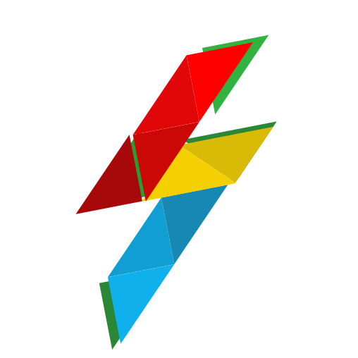

<p align="center">
  <a href="https://drash.io">
    
  </a>
  <h1 align="center">Sockets Client</h1>
</p>
<p align="center">A WebSocket client library for <a href="https://github.com/denoland/sockets">Deno Sockets</a>.</p>
<p align="center">
  <a href="https://discord.gg/SgejNXq">
    
  </a>
  <a href="https://twitter.com/drash_land">
    
  </a>
  <a href="https://github.com/drashland/sockets-client/releases">
    
  </a>
  <a href="https://github.com/drashland/sockets-client/actions">
    
  </a>
</p>

---

## Table of Contents
- [Quick Start](#quick-start)
- [Why use Sockets Client?](#why-use-sockets-client)
- [Contributing](#contributing)
- [License](#license)

## Quick Start
```
// File: index.html

<script src="client.js" type="module"></script>
```
```
// File: client.js

import SocketClient from "https://cdn.jsdelivr.net/gh/drashland/sockets-client@latest/client.js";

const client = new SocketClient({
  hostname: "localhost",
  port: 1667
})

client.on("some-event", (packet) => {

})

client.to("some-event", {
  some: "Data"
})
```

## Why Use Sockets Client?

Sockets client is designed to help you build projects with the ability to scale. It can improve the user experience, readability and maintainability of your socket clients, by providing event listeners and event emitters, over the usual `onmessage` handling.

Sockets Client takes concepts from the following:

* <a href="https://flask.palletsprojects.com/en/1.1.x/" target="_BLANK">Flask</a> &mdash; being <a href="https://flask.palletsprojects.com/en/1.1.x/foreword/#what-does-micro-mean" target="_BLANK">micro</a> and extensible

Thrown into the mix is Drashland's own concepts such as:

* Documentation-driven development
* Test-driven development
* Lowering barriers to usage

## Contributing

Contributors are welcomed!

Please read through our [contributing guidelines](https://github.com/drashland/.github/CONTRIBUTING.md). Included are directions for opening issues, coding standards, and notes on development.

## License
By contributing your code, you agree to license your contribution under the [MIT License](./LICENSE).
